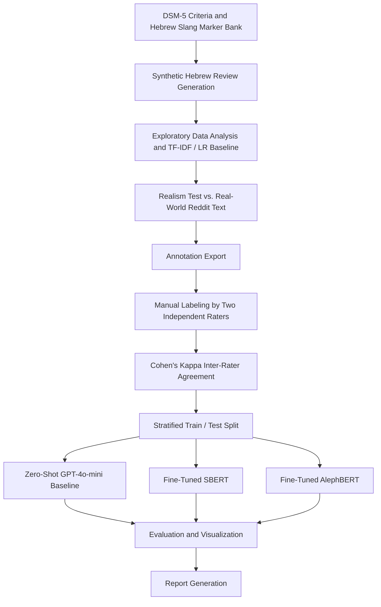

# Detection of PTSD Symptom Indicators in Hebrew Clinical Text Using Synthetic Data

This project implements an end-to-end NLP pipeline for automatically generating synthetic Hebrew text containing PTSD symptom indicators and training transformer-based models for multi-label symptom classification.

The pipeline generates DSM-5-grounded synthetic Hebrew utterances (in the informal register used by Israeli military veterans — WhatsApp messages, tweets, Reddit posts, diary entries), validates the generated data against real human-written text and against independent human annotators, and fine-tunes transformer models to predict which of eight PTSD symptom categories are present in a given text.

The project was demonstrated on one symptom domain — PTSD — but the pipeline architecture (documentation/criteria → aspect bank → controlled generation → validation → fine-tuning) generalizes to other clinical-symptom detection tasks.

---

## Team Members

- Rotem [Insert Last Name]
- Yuval [Insert Last Name]

Lecturer: [Insert Lecturer Name]

---

## Project Motivation

Informal self-disclosure of PTSD symptoms — in peer-support forums, messaging apps, or personal writing — is a low-friction signal that could support early triage and screening at scale, particularly for populations underserved by formal clinical assessment.

However, training a classifier for this task requires labeled clinical text in Hebrew, and real-world clinical text is scarce, sensitive, and constrained by privacy and IRB requirements. This becomes more difficult because the relevant symptom language is highly register-dependent — military slang and casual phrasing rarely resemble the clinical language used in diagnostic criteria.

This project addresses this challenge by using DSM-5 diagnostic criteria and a hand-curated bank of Hebrew clinical and military-slang markers to drive LLM-based generation of a validated synthetic dataset for PTSD symptom classification.

---

## Problem Statement

PTSD symptom disclosure in informal Hebrew text is unstructured free text. A single message may reference several symptom categories at once, may reference none (a hard negative that superficially resembles a symptom report), and the surface language varies widely by platform, severity, and explicitness.

Because labeled real-world clinical text in Hebrew is not available in sufficient volume or diversity, it is difficult to train a supervised multi-label classifier directly on real data.

The main problem addressed in this project is the lack of labeled, multi-label PTSD symptom data in Hebrew. To address this without compromising patient privacy, this project builds an automated pipeline that generates DSM-5-grounded synthetic text, validates it for realism and label quality, and trains multi-label symptom classifiers on the validated synthetic dataset.

---

## Visual Abstract

The following diagram summarizes the end-to-end pipeline, from synthetic data generation to validation, model fine-tuning, and evaluation.



---

## Datasets Used or Collected

The project includes one synthetic dataset, generated from DSM-5 diagnostic criteria and a hand-curated Hebrew military-slang marker bank.

| Dataset | Source | Records | Symptom Labels | Hard Negatives |
|---|---|---:|---:|---:|
| PTSD Hebrew Symptom Corpus | LLM-generated, DSM-5-grounded | 2000 | 8 | 500 |

Each dataset record contains:

- Hebrew review/message text
- a multi-hot label vector (zero or more of the 8 symptom categories)
- the DSM-5 sub-criterion that anchored the generation
- metadata: platform, explicitness, severity, example type, slang terms used

The dataset was generated automatically using an LLM and then validated using a real-text realism test and independent human annotation.

### Source References

| Reference | Document |
|---|---|
| DSM-5 PTSD diagnostic criteria mapping | [View document](src/data_generation.py) |
| Real-world reference corpus (Reddit) | [View / Download](data/golden_dataset.json) |

### Dataset Files

| Dataset | Full Corpus | Train Split | Test Split | Annotation Export |
|---|---|---|---|---|
| PTSD Hebrew Symptom Corpus | [View / Download JSON](data/dataset.json) | [View JSON](data/train_dataset.json) | [View JSON](data/test_dataset.json) | [View CSV](data/annotation_export.csv) |

---

## Data Augmentation and Generation Methods

Synthetic Hebrew text was generated using a controlled LLM-based process (OpenAI API, with local-Ollama and offline-mock fallbacks).

The generation process included:

1. Anchoring each generated record to a specific DSM-5 sub-criterion for one of the 8 PTSD symptom categories.
2. Conditioning generation on a hand-curated bank of Hebrew clinical-language and military-slang markers per label.
3. Varying surface form across four controlled axes: platform (WhatsApp, tweet, Reddit, diary), explicitness (explicit, implicit, behavioral), severity (mild, medium, strong), and example type (positive-clear, implicit, hard-negative, ambiguous).
4. Generating ~25% of the corpus as hard negatives — text that superficially resembles a symptom report but does not meet clinical criteria — to teach the model to discriminate true symptom language from surface-level lookalikes.
5. Writing the final labeled record (text, label vector, metadata) directly to the corpus file.
6. Validating the resulting corpus for realism and label quality before any model training (see [Validation and Quality Assurance](#validation-and-quality-assurance)).

This controlled generation strategy was used to ensure that the generated text and the assigned labels were aligned, and that the corpus was not trivially distinguishable from real-world disclosure text.

---

## Input / Output Examples

This project uses a multi-label, multi-hot classification approach.

Given a Hebrew message, the model predicts a presence/absence score for every symptom label.

```text
Hebrew text → Multi-hot symptom label vector
```

Score meaning:

```text
1 = symptom present (probability > 0.5 after sigmoid)
0 = symptom not present / not mentioned
```

Example synthetic dataset records:

```json
[
  {
    "id": "syn_0000",
    "text": "מאז שהיינו שם בפנים אני מתעצבן מכל שטות...",
    "labels": ["anger_irritability", "functional_impairment", "guilt_shame"],
    "example_type": "positive_clear",
    "platform": "diary",
    "explicitness": "behavioral",
    "severity": "strong",
    "dsm5_criterion": "E1+E2: Irritable behavior and angry outbursts",
    "synthetic": true
  },
  {
    "id": "syn_0152",
    "text": "[Insert hard-negative example text]",
    "labels": [],
    "example_type": "hard_negative",
    "platform": "whatsapp",
    "explicitness": "explicit",
    "severity": "mild",
    "dsm5_criterion": "",
    "synthetic": true
  }
]
```

---

## Models and Pipelines Used

The project pipeline contains the following stages:

1. DSM-5 criteria and Hebrew slang marker curation
2. Synthetic Hebrew text generation
3. Exploratory data analysis and TF-IDF / Logistic Regression baseline
4. Realism test against real-world reference text
5. Annotation export
6. Manual labeling by two independent annotators
7. Cohen's Kappa inter-rater agreement computation
8. Stratified train / test split (iterative stratification)
9. Zero-shot GPT-4o-mini baseline scoring
10. SBERT fine-tuning
11. AlephBERT fine-tuning
12. Model evaluation
13. Results visualization and report generation

Three models were evaluated and compared:

### GPT-4o-mini (Zero-Shot Baseline)

```text
Model: GPT-4o-mini
Task: multi-label symptom classification, zero-shot
Input: Hebrew message text
Output: structured multi-hot label vector (OpenAI structured outputs, no fine-tuning)
```

### SBERT (Fine-Tuned)

```text
Model: sentence-transformers/paraphrase-multilingual-MiniLM-L12-v2
Task: multi-label symptom classification, fine-tuned
Input: Hebrew message text
Output: per-label sigmoid probability vector
```

### AlephBERT (Fine-Tuned, Primary Model)

```text
Model: dicta-il/alephbertgimmel-base
Task: multi-label symptom classification, fine-tuned, native Hebrew pretraining
Input: Hebrew message text
Output: per-label sigmoid probability vector
```

---

## Training Process and Parameters

The fine-tuned models (SBERT, AlephBERT) were trained using a multi-label binary classification setup, with an independent sigmoid output per label.

Loss function:

$$
\text{BCE} = -\frac{1}{n}\sum_{i=1}^{n}\sum_{l=1}^{L}\Big[y_{i,l}\log(\hat{y}_{i,l}) + (1-y_{i,l})\log(1-\hat{y}_{i,l})\Big]
$$

Prediction threshold:

```text
ŷ > 0.5  → label present
otherwise → label not present
```

Training configuration:

```text
SBERT:
  Epochs: 10
  Learning rate: 2e-5
  Batch size: 16

AlephBERT:
  Epochs: 10
  Learning rate: 2e-5
  Batch size: 16

Train / validation split: 0.85 / 0.15 (carved from training fold)
Train / test split: 0.75 / 0.25 (iterative stratification, seed 1240)
```

---

## Metrics

The models were evaluated using the following metrics:

- Accuracy
- Precision (micro / macro)
- Recall (micro / macro)
- F1-Score (micro / macro)
- Per-label F1, Precision, Recall
- Misclassified-example error analysis
- Cohen's Kappa (inter-rater reliability, pre-training data validation)
- Realism detection rate (synthetic-vs-real discrimination, pre-training data validation)

---

## Results

### Results Comparison

The following graph compares the three evaluated models across the main evaluation metrics.


### Model Comparison Table

| Model | Accuracy | Precision (micro) | Recall (micro) | F1 (micro) | F1 (macro) |
|---|---:|---:|---:|---:|---:|
| TF-IDF + Logistic Regression | 74.0% | 86.3% | 83.4% | 84.9% | 82.1% |
| GPT-4o-mini (zero-shot) | 45.9% | 55.5% | 94.5% | 70.0% | 68.8% |
| SBERT (fine-tuned) | 76.0% | 84.4% | 91.2% | 87.7% | 83.8% |
| AlephBERT (fine-tuned) | 89.7% | 96.0% | 93.1% | 94.5% | 93.1% |

AlephBERT achieved stronger overall performance than the TF-IDF baseline, SBERT, and GPT-4o-mini across all evaluation metrics. Notably, the non-neural TF-IDF + Logistic Regression baseline outperforms the zero-shot GPT-4o-mini baseline, underscoring how much a few hundred labeled examples per class are worth relative to an untuned general-purpose LLM on this task.

---

### Per-Label Performance — AlephBERT (Fine-Tuned)

| Label | Precision | Recall | F1-Score |
|---|---:|---:|---:|
| sleep_disturbance | 100.0% | 100.0% | 100.0% |
| anger_irritability | 100.0% | 95.7% | 97.8% |
| intrusive_memories | 95.3% | 97.6% | 96.5% |
| hypervigilance | 99.0% | 94.1% | 96.4% |
| emotional_numbing | 92.5% | 92.5% | 92.5% |
| avoidance | 91.2% | 86.1% | 88.6% |
| guilt_shame | 92.1% | 81.4% | 86.4% |
| functional_impairment | 85.3% | 87.9% | 86.6% |

[Insert AlephBERT per-label precision/recall/F1 bar chart, if exported]

### Per-Label Performance — SBERT (Fine-Tuned)

| Label | Precision | Recall | F1-Score |
|---|---:|---:|---:|
| sleep_disturbance | 98.2% | 100.0% | 99.1% |
| anger_irritability | 97.1% | 97.1% | 97.1% |
| hypervigilance | 94.2% | 96.0% | 95.1% |
| avoidance | 78.0% | 88.9% | 83.1% |
| intrusive_memories | 80.0% | 85.7% | 82.8% |
| guilt_shame | 67.9% | 83.7% | 75.0% |
| functional_impairment | 65.8% | 75.8% | 70.4% |
| emotional_numbing | 61.2% | 75.0% | 67.4% |


---

### Baseline Comparison — TF-IDF / Logistic Regression (Train vs. Test, per label)


The gap between train and test F1 for `guilt_shame` (88.2% → 61.7%) is the largest of any label, consistent with the weak inter-rater agreement on this category (see [Validation and Quality Assurance](#validation-and-quality-assurance)) — the model is likely fitting on idiosyncratic generation patterns rather than a stable signal.

[Insert training/validation loss curve for SBERT, if exported]

[Insert training/validation loss curve for AlephBERT, if exported]

---

## Validation and Quality Assurance

The generated dataset was validated using several checks before annotation and training:

- Realism test against real-world reference text (forced-choice LLM discrimination task)
- Annotation export and independent double-labeling by two human raters
- Cohen's Kappa per-label inter-rater agreement
- Stratification quality check (per-label train/test ratio balance, Jensen-Shannon divergence)
- Misclassified-example export for qualitative error review

### Realism Test Summary

| Metric | Value |
|---|---:|
| Total pairs evaluated | 47 |
| Correct judge guesses | 24 |
| Detection rate | 51.1% |
| Flag threshold | 85.0% |
| Flagged as unrealistic | No |

A detection rate near 50% indicates the LLM judge could not reliably distinguish synthetic Hebrew text from real human-written text — the dataset passes the realism gate.

### Inter-Rater Reliability Summary (Cohen's Kappa)

| Label | Cohen's Kappa |
|---|---:|
| sleep_disturbance | 0.887 |
| anger_irritability | 0.853 |
| avoidance | 0.772 |
| hypervigilance | 0.677 |
| intrusive_memories | 0.494 |
| emotional_numbing | 0.432 |
| functional_impairment | 0.200 |
| guilt_shame | 0.000 |
| **Macro-average** | **0.539** |

Agreement is substantial for high-frequency, behaviorally explicit labels (sleep, anger, avoidance) and weak for low-frequency, more inferential labels (guilt/shame, functional impairment).

[Insert Kappa-per-label bar chart, if exported]

---

## Symptom Labels

The classification schema covers 8 DSM-5-aligned PTSD symptom categories:

- Intrusive Memories
- Avoidance
- Hypervigilance
- Sleep Disturbance
- Anger / Irritability
- Emotional Numbing
- Guilt / Shame
- Functional Impairment

Records with no applicable label (`labels: []`) are treated as hard negatives.

---

## Repository Structure

```text
ptsd_pipeline/
│
├── data/
│   ├── dataset.json
│   ├── train_dataset.json
│   ├── test_dataset.json
│   ├── golden_dataset.json
│   ├── annotation_export.csv
│   ├── annotation_rater1.csv
│   └── annotation_rater2.csv
│
├── artifacts/
│   ├── eda_tables.json
│   ├── baseline_eval.json
│   ├── realism_test_results.json
│   ├── kappa_results.json
│   ├── split_manifest.json
│   ├── eval_results.json
│   └── misclassified_errors.xlsx
│
├── visuals/
│   ├── 01_label_marginals.png
│   ├── 02_label_cooccurrence.png
│   ├── 02b_label_correlation.png
│   ├── 03_cardinality.png
│   ├── 04_length_by_platform.png
│   ├── 05_platform_x_type.png
│   ├── 06_severity_x_label.png
│   ├── 07_explicitness_x_label.png
│   ├── 08_slang_top20.png
│   ├── 09_model_comparison.png
│   ├── 10_tfidf_splits.png
│   └── 11_perlabel_finetuned.png
│
├── reports/
│   ├── slide3_summary.md
│   └── README_eda.md
│
├── src/
│   ├── config.py
│   ├── logging_setup.py
│   ├── data_generation.py
│   ├── eda.py
│   ├── validation.py
│   ├── splitting.py
│   ├── modeling.py
│   └── report.py
│
├── logs/
│   └── pipeline_run.log
│
├── presentations/
│   ├── interim_presentation.pdf
│   ├── interim_presentation.pptx
│   ├── final_presentation.pdf
│   └── final_presentation.pptx
│
├── run_pipeline.py
├── gpu_check.py
├── scrape_reddit.py
├── requirements-base.txt
├── requirements-cpu.txt
├── requirements-gpu.txt
├── README.md
└── .gitignore
```

---

## Main Folders

### `data/`

Contains the full synthetic corpus, the stratified train/test splits, the real-world reference corpus used for the realism test, and the annotation exports/rater files.

### `artifacts/`

Contains machine-readable pipeline outputs: EDA tables, baseline metrics, realism test results, Kappa results, split manifest, final evaluation metrics, and the misclassified-example export.

### `visuals/`

Contains EDA charts and model-comparison plots (300 DPI PNGs), referenced throughout this README.

### `reports/`

Contains human-readable Markdown summaries generated by the reporting stage.

### `presentations/`

Contains the interim and final project presentations in PDF and PowerPoint formats.

[Insert presentation files into this folder before submission]

---

## Source Code Structure

### `src/config.py`

Central path and hyperparameter constants for every stage of the pipeline.

### `src/data_generation.py`

Synthetic Hebrew text generator. Anchors generation to DSM-5 sub-criteria and a hand-coded Hebrew clinical/slang marker bank.

### `src/eda.py`

Exploratory data analysis (label marginals, co-occurrence, cardinality, platform/severity breakdowns) and the TF-IDF + Logistic Regression baseline.

### `src/validation.py`

Realism test, annotation export, and Cohen's Kappa computation.

### `src/splitting.py`

Iterative-stratification train/test split (Sechidis et al., 2011), with a synthetic negative class used to balance hard negatives during stratification.

### `src/modeling.py`

GPT-4o-mini zero-shot baseline, SBERT fine-tuning, and AlephBERT fine-tuning, plus test-set evaluation.

### `src/report.py`

Renders the slide-summary and EDA Markdown reports from pipeline artifacts.

---

## Presentations

| Presentation | PDF | PowerPoint |
|---|---|---|
| Interim Presentation | [Insert PDF link] | [Insert PPTX link] |
| Final Presentation | [Insert PDF link] | [Insert PPTX link] |

[Insert one-line description of what each presentation covers]

---

## How to Run

Install dependencies:

```bash
# GPU machines
pip install -r requirements-gpu.txt

# CPU-only machines
pip install -r requirements-cpu.txt
```

### Configuration

The project uses `src/config.py` to control dataset paths, output folders, model names, and hyperparameters.

### Run the full pipeline

```bash
python run_pipeline.py
```

### Run specific stages only

```bash
python run_pipeline.py --stages 3 4 5
```

### Common flags

```bash
python run_pipeline.py --skip-generation
python run_pipeline.py --skip-validation
python run_pipeline.py --mock
python run_pipeline.py --ollama llama3
```

### Compute Cohen's Kappa (after manual annotation)

```bash
python -c "from src.validation import compute_cohen_kappa; compute_cohen_kappa()"
```

### Build the real-world reference corpus

```bash
python scrape_reddit.py
```

---

## Technologies Used

- Python
- JSON / CSV
- Pandas
- scikit-learn
- scikit-multilearn
- PyTorch
- Hugging Face Transformers
- AlephBERT (`dicta-il/alephbertgimmel-base`)
- Sentence-Transformers (multilingual MiniLM)
- OpenAI API (`gpt-4o-mini`)
- Matplotlib / Seaborn
- arabic-reshaper / python-bidi (Hebrew text rendering in plots)

---

## Future Work

- Evaluate the fine-tuned models on real-world clinical or peer-support text.
- Improve inter-rater agreement on inferential labels (guilt/shame, functional impairment) through clearer annotation guidelines.
- Expand the realism test sample size beyond 47 pairs.
- Extend the symptom schema beyond PTSD to related trauma-adjacent conditions.

---

## Notes

The `.env` file is used for local environment variables and API keys and should not be uploaded to GitHub.

Large model files, checkpoints, and the virtual environment should be excluded from GitHub using `.gitignore`, including:

```text
.env
.venv/
model.safetensors
optimizer.pt
scheduler.pt
rng_state.pth
checkpoint-*/
__pycache__/
```
